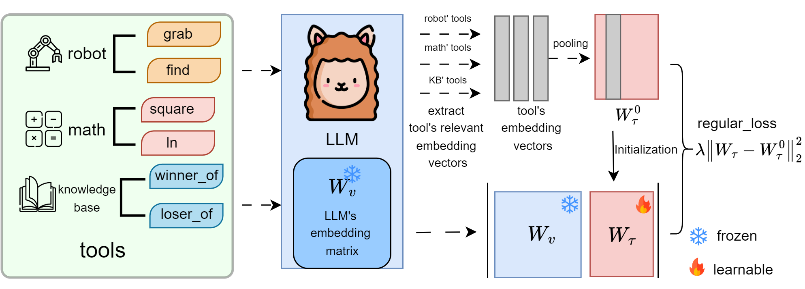

# TokenLearning
# TokenLearning
**Source code for [Re-Initialization Token Learning for Tool-Augmented Large Language Models](https://arxiv.org/abs/2305.11554)**



## Setup Environment
+ Our experiments are conducted with LLaMA2-7B/13B/70B, which takes at least 1/2/8 GPUs of 24GB memory each.
+ Download the data from [here](https://github.com/Ber666/ToolkenGPT) (all datasets uploaded)

```bash
conda create -n TokenLearning python=3.8
```

```bash
pip install -r requirements.txt
```

## GSM8K-XL

### Train

```bash
python -m torch.distributed.run --nproc_per_node 4 --master_port 1200 train_llama.py --ckpt_dir $PATH_TO_LLAMA --tokenizer_path $LLAMA/tokenizer.model --input_file data/gsm8k-xl/train.json --lr 1e-3 --num_epochs 10
```

### Inference

```bash
python -m torch.distributed.run --nproc_per_node 4 --master_port 1250 inference_llama.py --ckpt_dir $PATH_TO_LLAMA --tokenizer_path $LLAMA/tokenizer.model --mode func_embedding --dataset gsm8k-xl  --func_load_path checkpoints/gsm8k-xl/epoch_3.pth --logits_bias 3.0
```

### Evaluation

See `evaluation/eval_gsm8k.ipynb`

## FuncQA

### Train

```bash
python -m torch.distributed.run --nproc_per_node 4 --master_port 1200 train_llama.py --ckpt_dir $PATH_TO_LLAMA --tokenizer_path $PATH_TO_LLAMA/tokenizer.model --input_file data/funcqa/train.json --lr 1e-4 --num_epochs 10
```

### Inference (1-hop)

```bash
python -m torch.distributed.run --nproc_per_node 4 --master_port 1250 inference_llama.py --ckpt_dir $PATH_TO_LLAMA --tokenizer_path $LLAMA_CKPTS/tokenizer.model --mode func_embedding --dataset funcqa_oh --func_load_path checkpoints/funcqa/epoch_7.pth --logits_bias 2.7
```

### Inference (MultiHop)

```bash
python -m torch.distributed.run --nproc_per_node 4 --master_port 1250 inference_llama.py --ckpt_dir $PATH_TO_LLAMA --tokenizer_path $LLAMA_CKPTS/tokenizer.model --mode func_embedding --dataset funcqa_mh --func_load_path checkpoints/funcqa/epoch_7.pth --logits_bias 4.0
```

### Evaluation

See `evaluation/eval_funcqa.ipynb`

## VirtualHome

### Training
```bash
python -m torch.distributed.run --nproc_per_node 2 --master_port 3001 train_llama.py --ckpt_dir $PATH_TO_LLAMA --tokenizer_path $LLAMA_CKPTS/tokenizer.model --dataset vh --input_file data/vh/legal_train_v4_embedding.json --only_functoken True --num_epochs 10
```


### Inference

```bash
python -m torch.distributed.run --nproc_per_node 2 inference_llama.py --ckpt_dir $PATH_TO_LLAMA --tokenizer_path $LLAMA_CKPTS/tokenizer.model --mode vh_embedding_inference --dataset vh --func_load_path checkpoints/vh/epoch_7.pth --logits_bias 10.0
```

### Evaluation

See `evaluation/eval_vh.ipynb`

## KAMEL
### Train
+ synthetic data
```bash
python -m torch.distributed.run --nproc_per_node 2 --master_port 3002 train_llama.py --ckpt_dir $PATH_TO_LLAMA --tokenizer_path $LLAMA_CKPTS/tokenizer.model --dataset kamel --input_file data/kamel/train_clean.json --only_functoken False ---log_every 500 --num_epochs 10
```

### Inference

```bash
python -m torch.distributed.run --nproc_per_node 2 inference_llama.py --ckpt_dir $PATH_TO_LLAMA --tokenizer_path $LLAMA_CKPTS/tokenizer.model --mode kamel_embedding_inference --dataset kamel_30 --func_load_path checkpoints/kamel/epoch_4.pth --logits_bias 10
```

### Evaluation

See `evaluation/eval_kamel.ipynb`
